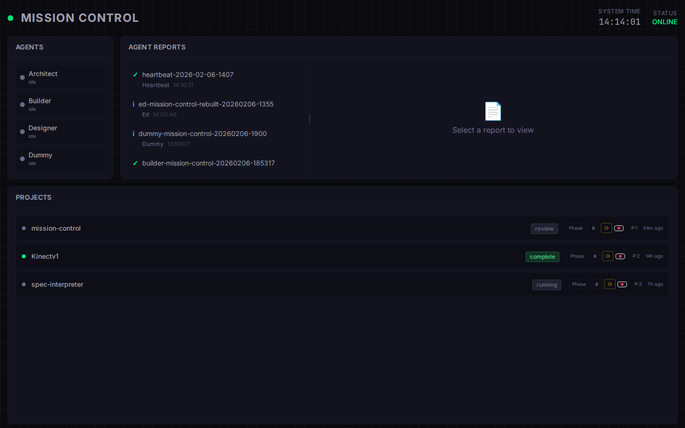
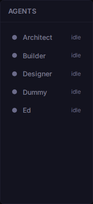
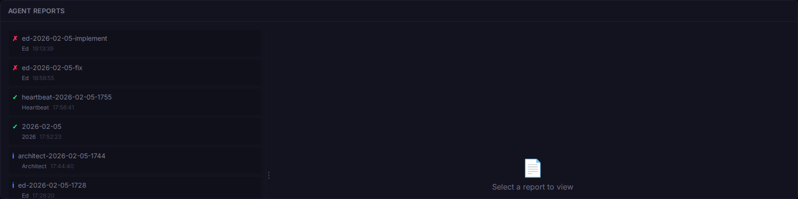
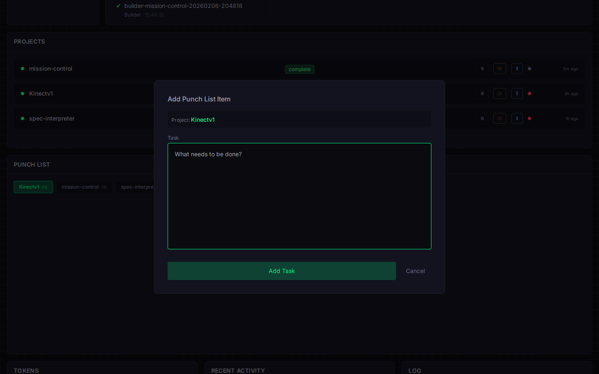
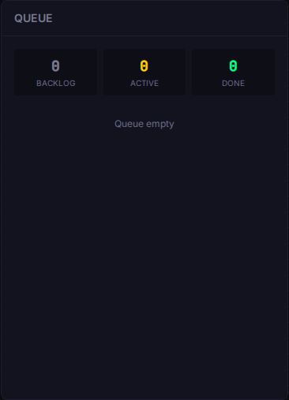

# 🚀 Mission Control

> A NASA-style mission control dashboard for managing OpenClaw AI agents, projects, and token usage.



## ✨ Features

### 📊 Real-Time Project Monitoring
Track all your OpenClaw projects in one place. View current phase, priority, blocked status, and last activity at a glance.



**Key Capabilities:**
- **Phase Management** — Drag-and-drop phase transitions (plan → implement → build → test → fix → complete)
- **Priority Queue** — Visual priority indicators with sorting
- **Block/Unblock** — Pause/resume projects with one click
- **Restart & Git Push** — Direct controls for project lifecycle
- **Backend Status** — Live health indicators for each project's services

### 🤖 Agent Coordination
Monitor all AI agents in real-time. See who's working, what they're working on, and their current status.



**Agent States:**
- 🟢 **Idle** — Agent available for work
- 🟡 **Working** — Agent actively processing
- 🔴 **Error** — Agent encountered an issue

### 💰 Token Tracking & Cost Management
Real-time token usage monitoring with cost estimation across all projects.

**Features:**
- Per-project token breakdown (input/output)
- Estimated cost calculations
- Budget alerts and warnings
- Historical usage trends
- Grand total across all projects

### 📋 Task Queue Management (EXCHANGE)
Centralized task queue for coordinating work between agents.

**Queue Operations:**
- View pending, active, and completed tasks
- Create new tasks with priority
- Assign tasks to specific agents
- Track task lifecycle from claim to completion



### 📑 Agent Reports
Access recent reports from all agents in one place.



### 📜 Live Activity Log
Real-time event stream showing system activity, phase changes, and agent actions.

---

## 🏗️ Architecture

### The EXCHANGE Protocol

Mission Control is built around the **EXCHANGE** — a coordination layer that enables agent collaboration:

```
┌─────────────────────────────────────────────────────────────┐
│                     EXCHANGE SYSTEM                         │
├─────────────────────────────────────────────────────────────┤
│                                                             │
│  ┌──────────────┐    ┌──────────────┐    ┌──────────────┐  │
│  │    Queue     │    │    Flags     │    │   Reports    │  │
│  │  (Tasks)     │◄──►│  (Status)    │◄──►│  (History)   │  │
│  └──────┬───────┘    └──────┬───────┘    └──────┬───────┘  │
│         │                   │                    │          │
│         ▼                   ▼                    ▼          │
│  ┌─────────────────────────────────────────────────────┐   │
│  │              AGENT POLLER (5min cycle)              │   │
│  │  ┌─────────┐  ┌─────────┐  ┌─────────┐  ┌────────┐ │   │
│  │  │Architect│  │   Ed    │  │ Builder │  │ Dummy  │ │   │
│  │  │ (plan)  │  │(implement│  │ (build) │  │ (test) │ │   │
│  │  └────┬────┘  │ /fix)   │  └────┬────┘  └───┬────┘ │   │
│  └───────┼───────┴────┬────┴───────┼───────────┼──────┘   │
│          │            │            │           │           │
└──────────┼────────────┼────────────┼───────────┼───────────┘
           │            │            │           │
           ▼            ▼            ▼           ▼
      ┌─────────────────────────────────────────────────┐
      │               PROJECTS/ DIRECTORY               │
      │  ┌─────────┐  ┌─────────┐  ┌─────────────────┐  │
      │  │Kinectv1 │  │mission- │  │  spec-interpreter│  │
      │  │         │  │control  │  │                  │  │
      │  │04-phase │  │04-phase │  │   04-phase       │  │
      │  │complete │  │  fix    │  │   complete       │  │
      │  └─────────┘  └─────────┘  └─────────────────┘  │
      └─────────────────────────────────────────────────┘
```

### How It Works

1. **Phase-Based Routing**
   - Projects have a `04-phase` file (plan/implement/build/test/fix/complete)
   - The poller checks projects every 5 minutes
   - When a project enters a phase, the corresponding agent is spawned

2. **Agent Lifecycle**
   ```
   ┌──────────┐     ┌──────────┐     ┌──────────┐     ┌──────────┐
   │  IDLE    │────►│ WORKING  │────►│ REPORT   │────►│  IDLE    │
   │          │     │ Set Flag │     │ Write    │     │ Clear    │
   │          │     │          │     │ Report   │     │ Flag     │
   └──────────┘     └──────────┘     └──────────┘     └──────────┘
   ```
   - Agent sets `.{agent}-working` flag in `EXCHANGE/flags/`
   - Agent does the work
   - Agent writes report to `EXCHANGE/reports/`
   - Agent clears the flag

3. **Task Queue Priority**
   - EXCHANGE queue tasks override phase-based routing
   - Higher priority (lower number) tasks claimed first
   - Tasks flow: pending → active (claimed) → done

### File-Based State Management

Mission Control uses the filesystem as its state store:

```
workspace/
├── PROJECTS/
│   └── {project}/
│       ├── 01-prompt.md        # Project description
│       ├── 02-architecture.md  # Technical design
│       ├── 03-plan.json        # Implementation plan
│       ├── 04-phase            # Current phase (plain text)
│       ├── 05-priority         # Priority number
│       ├── 05-blocked          # Blocked flag (file exists = blocked)
│       ├── 06-test-results.json # Test output
│       ├── 07-bugs.md          # Known issues
│       └── 09-tokens.json      # Token usage
├── EXCHANGE/
│   ├── flags/
│   │   ├── .architect-working  # Agent status flags
│   │   ├── .ed-working
│   │   ├── .builder-working
│   │   └── .dummy-working
│   ├── queue/
│   │   ├── pending/            # Unclaimed tasks
│   │   ├── active/             # Claimed tasks
│   │   └── done/               # Completed tasks
│   ├── reports/                # Agent output
│   └── tasks/                  # Task definitions
└── memory/                     # Agent session logs
```

---

## 🚀 Getting Started

### Prerequisites

- Node.js 18+
- OpenClaw workspace structure set up
- Projects in `PROJECTS/` directory

### Installation

```bash
cd PROJECTS/mission-control/code
npm install
```

### Running the Dashboard

```bash
npm run dev
```

The dashboard will be available at:
- Local: `http://localhost:5173`
- Network: `http://YOUR_IP:5173`

### Building for Production

```bash
npm run build
```

---

## 🎛️ Dashboard Components

| Component | Description | Location |
|-----------|-------------|----------|
| **ProjectMonitor** | Project cards with phase controls | `src/components/ProjectMonitor.jsx` |
| **AgentStatus** | Real-time agent activity | `src/components/AgentStatus.jsx` |
| **TokenMonitor** | Token usage & cost tracking | `src/components/TokenMonitor.jsx` |
| **QueueStatus** | EXCHANGE task queue | `src/components/QueueStatus.jsx` |
| **AgentReports** | Recent agent reports | `src/components/AgentReports.jsx` |
| **LiveLog** | Activity feed | `src/components/LiveLog.jsx` |
| **SystemHealth** | System metrics | `src/components/SystemHealth.jsx` |

---

## 🔌 OpenClaw Integration

Mission Control is designed to work seamlessly with OpenClaw:

### Agent Configuration

Each agent has a workspace directory with instructions:

```
workspace-architect/AGENTS.md   # Plan phase agent
workspace-ed/AGENTS.md          # Implement/fix agent
workspace-builder/AGENTS.md     # Build phase agent
workspace-dummy/AGENTS.md       # Test phase agent
workspace-designer/AGENTS.md    # Review/design agent
```

### Polling Integration

The poller script (`agent-poller.sh`) coordinates with Mission Control:

```bash
# Checks EXCHANGE/flags/ before spawning agents
if [ -f "$WORKSPACE/EXCHANGE/flags/.ed-working" ]; then
  return 1  # Agent busy, skip
fi

# Spawns agent with instructions
openclaw agent --agent "ed" --local --message "..."
```

---

## 🎨 Customization

### Color Scheme

Edit `tailwind.config.js`:

```javascript
colors: {
  'mission': {
    bg: '#0a0a0f',      // Deep space black
    panel: '#13131f',   // Panel background
    border: '#1e1e2e',  // Borders
    text: '#e0e0ff',    // Primary text
    muted: '#6b6b8a'    // Secondary text
  },
  'status': {
    active: '#00ff88',   // Success green
    working: '#ffcc00',  // Warning yellow
    error: '#ff3366',    // Error red
    idle: '#6b6b8a'      // Idle gray
  }
}
```

### Panel Layout

The dashboard supports drag-and-drop panel rearrangement:

1. Click "Rearrange" toggle
2. Drag panels to new positions
3. Click "Done" to save layout

---

## 📊 Token Cost Calculation

Costs are calculated using standard rates:

| Type | Rate (per 1K tokens) |
|------|---------------------|
| Input | $0.01 |
| Output | $0.03 |

Formula: `(input_tokens × 0.00001) + (output_tokens × 0.00003)`

---

## 🔒 Security

- **LAN-only** — Binds to `0.0.0.0` for local network access
- **Read-only** — Dashboard reads workspace state, doesn't modify directly
- **No external APIs** — All data stays local

---

## 🛠️ Troubleshooting

### Dashboard won't load
```bash
# Check if port 5173 is available
lsof -i :5173

# Kill existing process if needed
pkill -f vite
```

### Projects not showing
```bash
# Verify PROJECTS/ directory exists
ls /home/molten/.openclaw/workspace/PROJECTS/
```

### Agents stuck in "working" state
```bash
# Clear stale working flags
rm /home/molten/.openclaw/workspace/EXCHANGE/flags/.*-working
```

---

## 🤝 Contributing

1. Set project to `fix` phase in dashboard
2. The poller will spawn ed to implement changes
3. Review the agent's report in EXCHANGE/reports/
4. Merge changes via dashboard's Git Push button

---

## 📜 License

MIT License — OpenClaw Project

---

<div align="center">

**Built with React · Vite · Tailwind CSS · OpenClaw**

</div>
